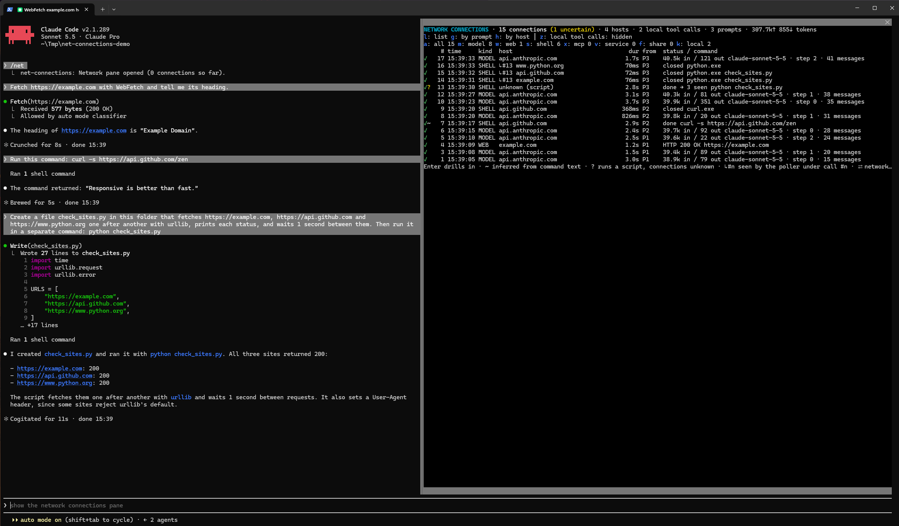
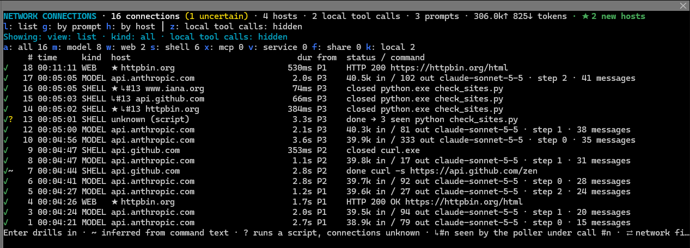
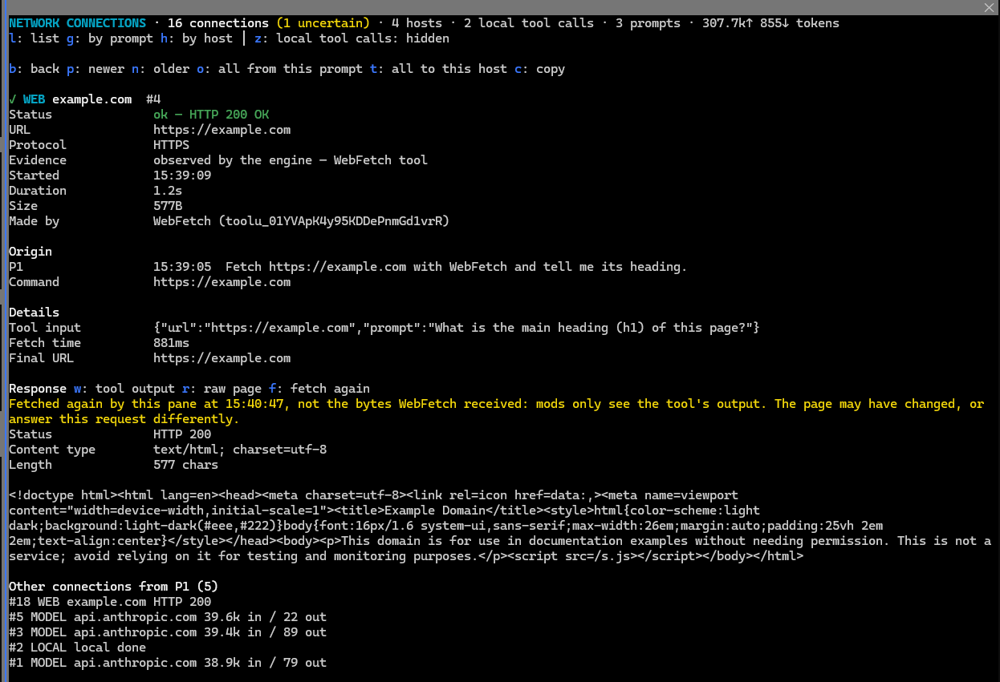
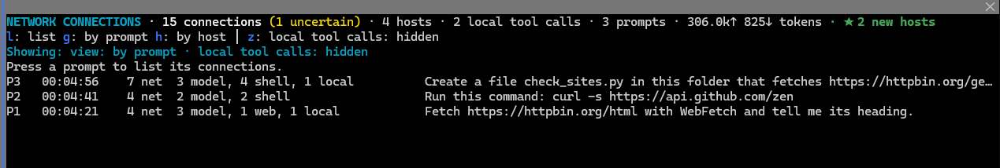
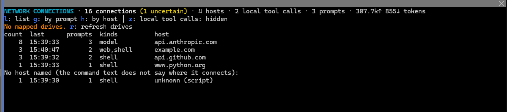

# net-connections

A [Claude Code](https://claude.com/claude-code) mod that adds a **Network connections** pane: every network connection a session makes, traced back to the prompt and the command that caused it.



## What it shows

| Kind | Source | Evidence |
| --- | --- | --- |
| `MODEL` | each Messages API request (turn step): model, tokens, time to first chunk | observed |
| `WEB` | `WebFetch` / `WebSearch`: status, size, the tool's output, and on request the page's raw body | observed |
| `SHELL` | Bash / PowerShell commands: hosts read off the command text (`curl`, `git push`, `pip install`, …) | `~` inferred, `?` uncertain (scripts, interpreters) |
| `SHELL` `↳#n` | **Windows:** connections the processes of shell call `#n` actually opened, seen in the TCP table | observed |
| `MCP` / `SVC` | MCP tool calls, claude.ai connectors and services | observed |
| `SHARE` | file access on UNC paths, mapped network drives and network mounts | observed / inferred |

Local tool calls (Read, Edit, …) are kept too, so each prompt's calls are complete, but hidden by default.

## Use

- `/net` opens the pane, also while a turn is running.
- `/net clear` empties the log. `/net drives` (or `/net mounts`) lists network drives.
- Keys in the pane: `l` list, `g` by prompt, `h` by host, `z` show local calls, Enter for details, `b` back to where you came from, `n`/`p` older/newer.
- WebFetch details: `w` tool output, `r` raw page (fetched again by the pane, listed as its own connection), `j`/`k` parts of a long body.
- Poller rows: `u` jumps to the call that caused it; on a call, `1`–`9` jump to the connections seen under it.

## The poller (Windows)

The engine reports a shell call, not what its processes connect to. While shell calls run, the mod runs a small PowerShell loop (`hooks/poller.ts`) that reads the TCP table and the process list through the Win32 API every 25 ms and reports connections of processes Claude Code started. It stops 30 s after the last shell call.

Here `python check_sites.py` shows no host in its command line, so the call itself is only `?` uncertain; the poller saw the three connections the script made:



Limits: a connection that opens and closes between two looks is missed; a process whose parent already exited (a daemonized child) cannot be traced to Claude Code; with parallel shell calls the call a connection is attributed to may be off.

## WebFetch: tool output and raw page

Mods only see what WebFetch hands back: its processed output. `r` fetches the page again and shows the raw body, in parts for long pages; `w` switches back to the tool output.



## Grouped views

By prompt (`g`) and by host (`h`):





## New hosts

With the option `flagNewHosts` (on by default; a row in the config menu), a host no earlier session connected to is marked `★` in the list, `★ NEW` in the by-host view, `★ NEW HOST` in its details, and counted in the header. Only hosts the engine or poller actually observed are remembered; a host guessed from command text (`~` or `?`) does not count as seen. Hosts are remembered across sessions, so the flag shows only in the session that first saw the host. The first run flags every host, as none are known yet. With the option off, hosts are still remembered, so switching it on later does not flag everything.

## Privacy

- The connection log stays in the session's memory. The only thing written to disk is the list of host names seen so far (the mod's `$.store`, key `knownHosts`, at most 5000 hosts), used for the new-host flag above. Nothing is sent anywhere.
- Command lines are recorded in full, with two exceptions: home directories are shown as `~`, and credentials (`Authorization` headers, bearer tokens, `--password=…`, `API_KEY=…`, `user:pass@` in URLs, well-known token formats) are masked as `***` before they are kept.
- The only requests the mod makes itself are the raw-page fetches you ask for with `r`.

## Install

Clone into a folder and load it as a plugin directory:

```sh
claude --plugin-dir /path/to/net-connections
```

Claude Code writes the API types into `.claude-plugin/types/` when it loads the mod; `tsc -p .` type-checks it after that, and `claude plugin test .` runs the tests.
